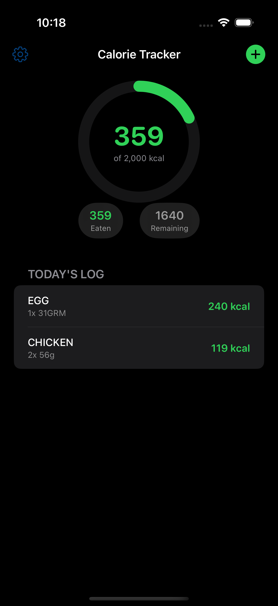
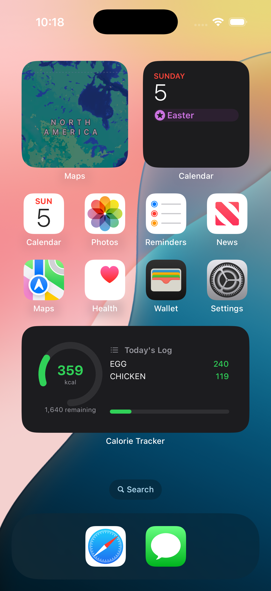
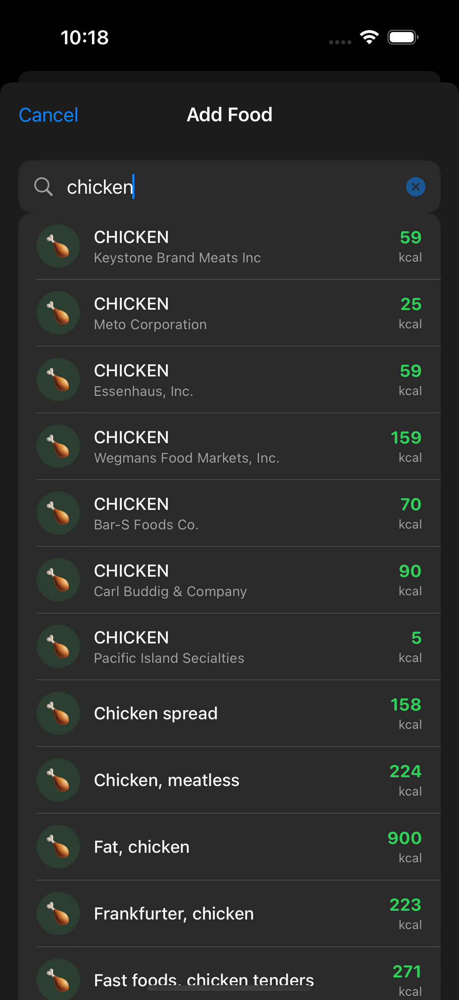
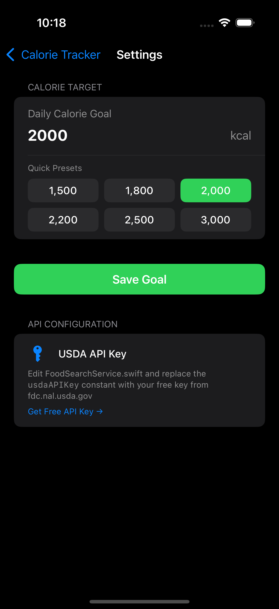

# CalorieTracker

<p align="center">
  
</p>

<p align="center">
  
  
  
  
  
  
</p>

<p align="center">
  A native SwiftUI calorie tracking app with a live home screen widget, powered by the USDA FoodData Central API (1M+ foods).
</p>

---

## Screenshots

<p align="center">
  
  &nbsp;&nbsp;
  
  &nbsp;&nbsp;
  
</p>

---

> [!IMPORTANT]
> **Target Membership — Required for both shared files**
> In Xcode, select `SharedModels.swift` → press **⌘ ⌥ 1** (File Inspector) → under **Target Membership**, check **both** `CalorieTracker` and `CalorieWidget`. Repeat for `FoodSearchService.swift`.
> Missing a checkbox = `Cannot find type in scope` build errors.

## Features

- **Live Home Screen Widget** — Small & medium sizes showing today's calories vs. goal, auto-refreshes every 15 minutes and resets at midnight
- **Deep Link from Widget** — Tap the widget to open the Add Food sheet directly via a custom URL scheme
- **USDA Autocomplete Search** — Live search across 1M+ foods with 300ms debounce powered by the FoodData Central API
- **Serving Size Control** — Inline `+` / `−` stepper to adjust portions before logging
- **App Group Sync** — Widget and app share data through a shared `UserDefaults` App Group suite — always in sync
- **Calorie Ring** — Adaptive color ring: 🟢 green under 85%, 🟠 orange 85–100%, 🔴 red over goal
- **Daily Goal Settings** — Presets + custom input; default is 2,000 kcal
- **Persistent Storage** — JSON-encoded entries in App Group UserDefaults, auto-pruned to the last 30 days

---

## Tech Stack

| Layer | Technology |
|---|---|
| Language | Swift 5.9 |
| UI Framework | SwiftUI |
| Widget | WidgetKit (Static Configuration) |
| Data Sync | App Groups · UserDefaults suite |
| API | USDA FoodData Central REST API |
| Async | Swift Concurrency (`async/await`, `Task`) |
| Storage | `JSONEncoder` / `JSONDecoder` over UserDefaults |
| Deep Linking | Custom URL Scheme (`calorietracker://`) |

---

## Project Structure

```
CalorieTracker/
├── Shared/
│   ├── SharedModels.swift          # FoodLogEntry model + SharedCalorieStore (App Group)
│   └── FoodSearchService.swift     # USDA API client + debounced search
├── CalorieTrackerApp/
│   ├── CalorieTrackerApp.swift     # App entry point + .onOpenURL deep link handler
│   ├── ContentView.swift           # Calorie ring + food log list
│   ├── AddFoodView.swift           # Search sheet + autocomplete + log action
│   └── SettingsView.swift          # Daily goal picker + presets
└── CalorieWidget/
    └── CalorieWidget.swift         # Widget timeline provider + small & medium layouts
```

---

## Getting Started

### Prerequisites

- Xcode 15+
- iOS 17+ deployment target
- A free [USDA FoodData Central API key](https://fdc.nal.usda.gov/api-key-signup.html)

### 1 — Clone & Open

```bash
git clone https://github.com/jotx19/CalorieTracker.git
cd CalorieTracker
open CalorieTracker.xcodeproj
```

### 2 — Add the Widget Extension

1. **File → New → Target → Widget Extension**
2. Name: `CalorieWidget`
3. Uncheck **"Include Configuration Intent"** (uses Static configuration)

### 3 — Configure App Groups

> This is required for the widget and app to share data.

1. Select the **CalorieTracker** target → **Signing & Capabilities** → `+` → **App Groups**
2. Add: `group.com.yourname.calorietracker`
3. Repeat for the **CalorieWidget** target
4. Update `appGroupID` in `SharedModels.swift`:

```swift
let appGroupID = "group.com.yourname.calorietracker"
```

### 4 — Set Your USDA API Key

Open `FoodSearchService.swift` and replace:

```swift
let usdaAPIKey = "DEMO_KEY"
```

with your actual key. `DEMO_KEY` works but is limited to **30 req/hour, 50/day**.

### 5 — Add the URL Scheme

In the main app target's `Info.plist`, add:

```xml
<key>CFBundleURLTypes</key>
<array>
    <dict>
        <key>CFBundleURLSchemes</key>
        <array>
            <string>calorietracker</string>
        </array>
    </dict>
</array>
```

Then in `CalorieTrackerApp.swift`, wire the deep link:

```swift
@main
struct CalorieTrackerApp: App {
    @State private var showAddFood = false

    var body: some Scene {
        WindowGroup {
            ContentView(showAddFood: $showAddFood)
                .onOpenURL { url in
                    if url.scheme == "calorietracker" && url.host == "add" {
                        showAddFood = true
                    }
                }
        }
    }
}
```

### 6 — File Target Membership

| File | Main App | Widget |
|---|:---:|:---:|
| `SharedModels.swift` | ✅ | ✅ |
| `FoodSearchService.swift` | ✅ | ✅ |
| `ContentView.swift` | ✅ | ❌ |
| `AddFoodView.swift` | ✅ | ❌ |
| `SettingsView.swift` | ✅ | ❌ |
| `CalorieWidget.swift` | ❌ | ✅ |

---

## Data Flow

```
USDA FoodData Central API
        │
        ▼
FoodSearchService (async/await + debounce)
        │
        ▼
AddFoodView (search UI + serving stepper)
        │
        ▼
SharedCalorieStore ─── App Group UserDefaults ───► CalorieWidget
        │                                                │
        ▼                                                ▼
ContentView                              WidgetCenter.reloadAllTimelines()
  (ring + log)
```

---

## Widget

| Size | Content |
|---|---|
| **Small** | Calorie arc ring · total kcal · remaining · goal |
| **Medium** | Ring (left) · recent food log entries · progress bar (right) |

The widget refreshes every **15 minutes** via `TimelineReloadPolicy.atEnd`, and includes a midnight boundary entry to reset the daily display automatically.

---

## USDA API Reference

| Property | Value |
|---|---|
| Endpoint | `https://api.nal.usda.gov/fdc/v1/foods/search` |
| Energy Nutrient ID | `1008` (kcal) |
| Data Types | Branded · SR Legacy · Foundation |
| Free Tier | 1,000 requests/hour with your key |
| DEMO_KEY Rate Limit | 30/hour · 50/day |

---

## Customization

```swift
// SharedModels.swift

// Change default daily calorie goal
var dailyLimit: Int {
    get { defaults?.integer(forKey: "dailyLimit") ?? 2000 }
}

// FoodSearchService.swift

// Number of search results returned
let pageSize = 20

// Search debounce delay (nanoseconds)
try await Task.sleep(nanoseconds: 300_000_000) // 300ms
```

---

## License

This project is licensed under the [MIT License](LICENSE).

---

<p align="center">
  Built with SwiftUI · WidgetKit · USDA FoodData Central
</p>